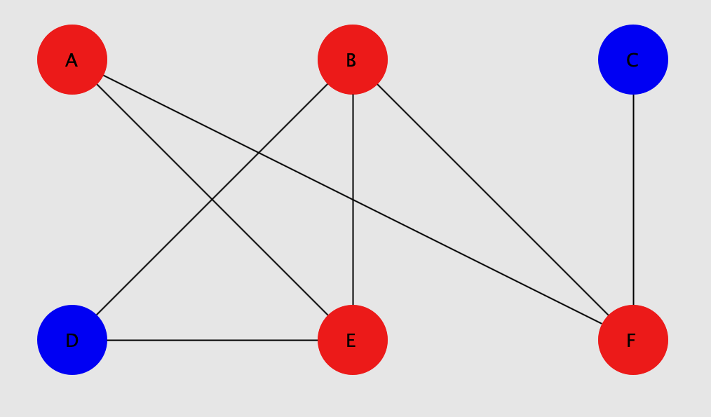

# Graph Visualization 

## Description
This Project implements Dfs in Java and animates DFS inside a desktop app.

## Installation
Install miniconda, after activating anaconda environment install the necessary packages in requirements.txt

## License
Distributed under the MIT License. See `LICENSE` for more information.

